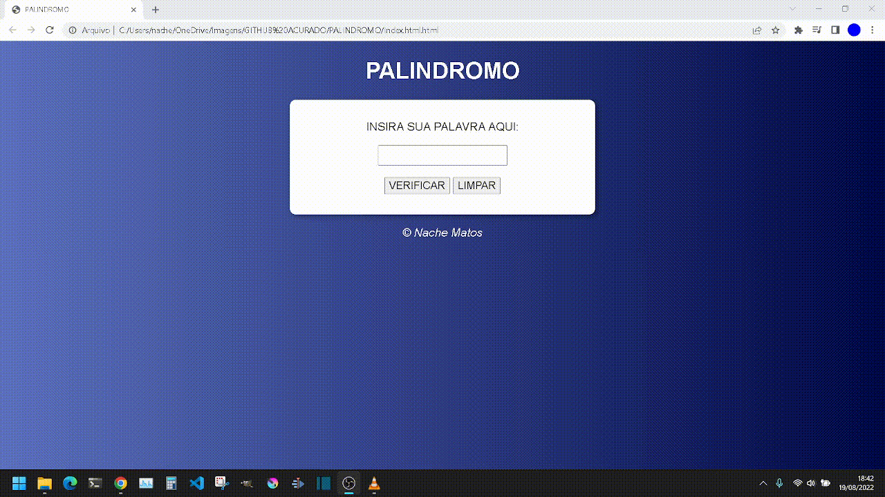

# Verificador de palíndromo

Pequeno projeto feito com HTML, CSS e Javascript Puro, consiste em um verificador de palíndromo onde o usuario digita uma palavra e recebe o resuldado se a palavra é ou não palíndromo.

- Palíndromo

Frase ou palavra que se pode ler, indiferentemente, da esquerda para a direita ou vice-versa.

